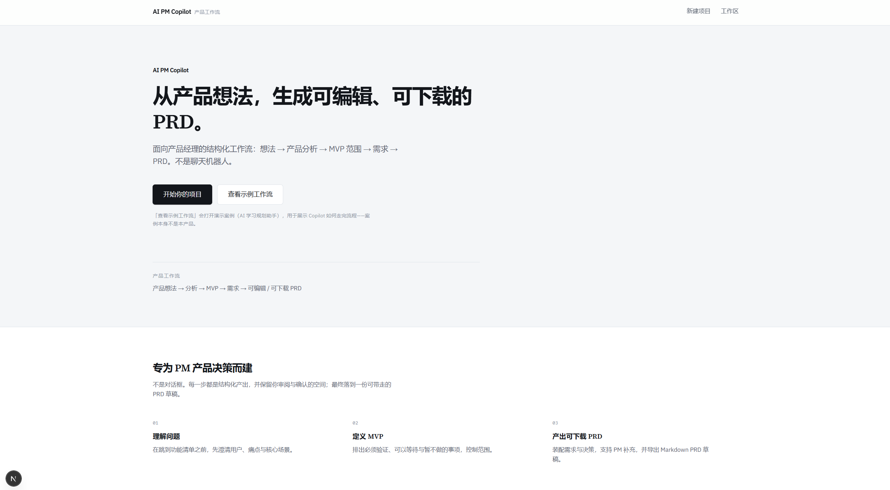
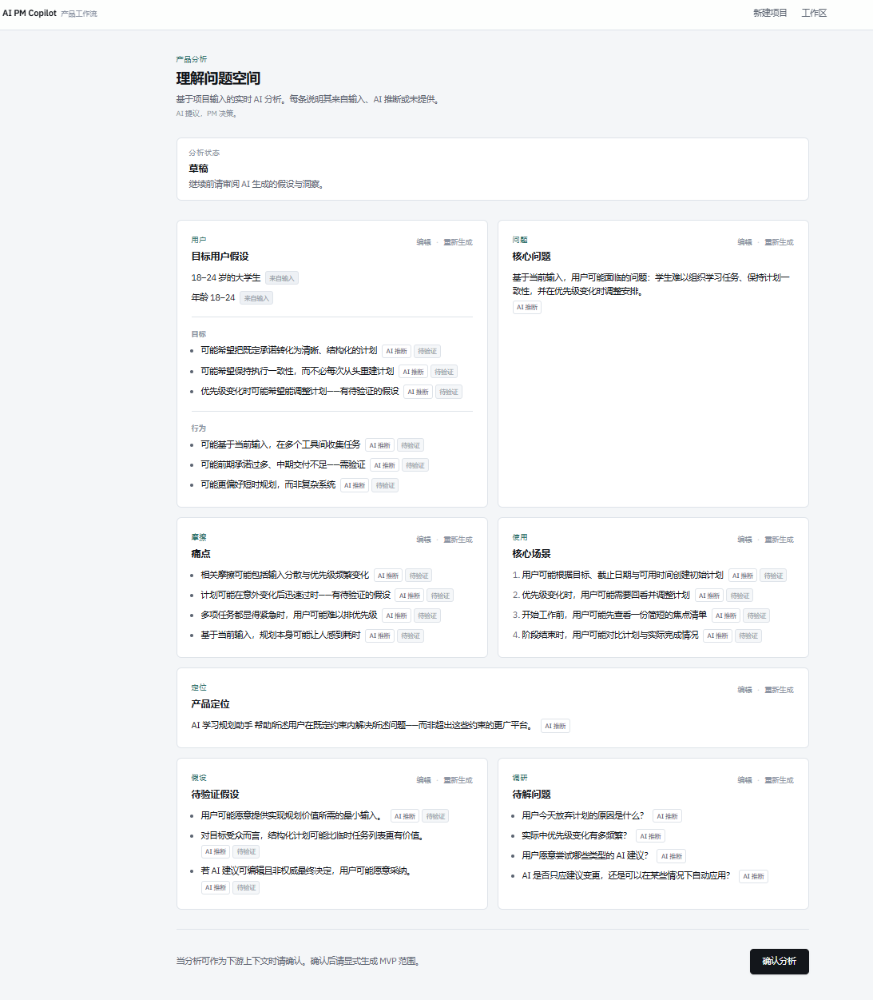
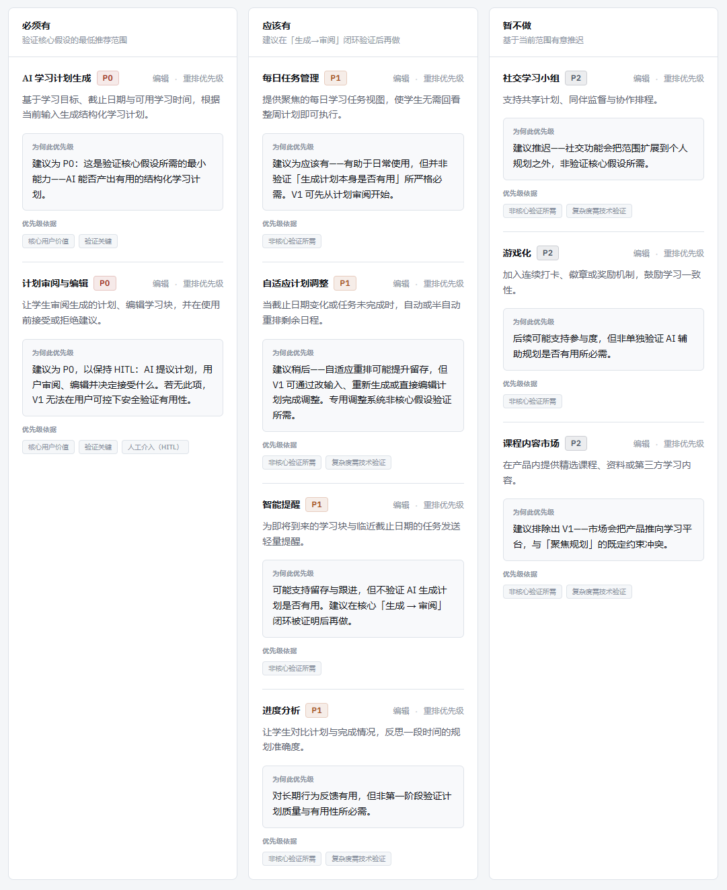
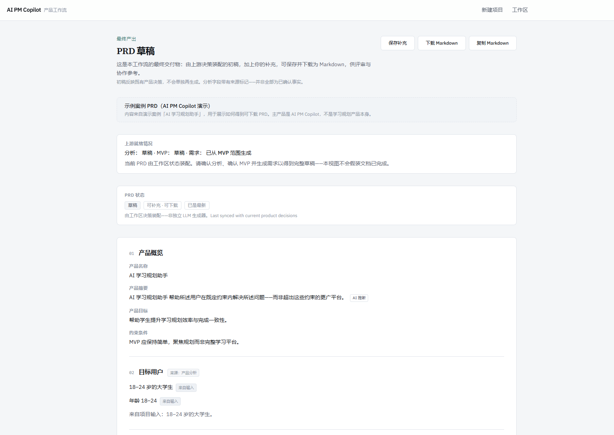

# AI PM Copilot

> 将模糊产品想法转化为结构化、可编辑、可下载 PRD 的 AI 产品工作流。

**AI 提供建议，PM 做最终决策。**

AI PM Copilot 是一个面向产品经理的 AI Copilot。它不是让 AI 一次性替 PM 写完 PRD，而是把产品早期工作拆成多个可审阅的决策阶段：

**Product Idea → Product Analysis → MVP Prioritization → Requirements → PRD**

AI 在每个阶段提供结构化分析和建议，PM 保留关键决策、修改与确认权。最终产出是一份可以继续补充并下载使用的 PRD 草稿。

---

## Product Workflow

```text
Product Idea
     ↓
Product Analysis
     ↓
PM Review & Confirm
     ↓
MVP Prioritization
     ↓
PM Review & Confirm
     ↓
Requirements Generation
     ↓
PRD Assembly
     ↓
PM Supplement
     ↓
Download PRD
```

### Core Principle

**AI 提供建议，PM 做最终决策。**

AI PM Copilot 重点解决的不是“如何生成更多内容”，而是：

- 如何把模糊产品想法结构化
- 如何帮助 PM 做 MVP 取舍
- 如何防止 AI 推断被当成已确认事实
- 如何让最终 PRD 保留上游产品决策

---

## Product Screenshots

### 1. Product Idea → Workflow



从模糊产品想法开始，进入分阶段 AI 产品决策流程。

### 2. Product Analysis



结构化用户问题、假设与场景，并通过 provenance 区分用户输入和 AI 推断。

### 3. MVP Prioritization



围绕最小用户价值闭环判断 P0 / P1 / P2，并展示 rationale 与 trade-offs。

### 4. PRD Output



最终将上游产品决策装配成可由 PM 继续补充并下载的 PRD 草稿。

---

## Why This Product

产品经理从一个模糊想法走到可讨论、可执行的产品方案，中间需要完成大量结构化判断：

- 明确目标用户与核心问题
- 梳理关键假设
- 判断 MVP 应该做什么、不做什么
- 把产品方向进一步拆解为需求
- 最终整理成可以继续讨论和修改的 PRD

直接使用一次性 LLM 生成 PRD 很快，但容易跳过问题定义和产品取舍，也容易把 AI 推断包装成看起来很正式的产品事实。

因此，AI PM Copilot 采用分阶段工作流，让 AI 参与产品思考过程，但不静默替代 PM 的判断。

---

## Key Product Decisions

### 1. 不直接生成最终 PRD

没有采用：

```text
Product Idea → LLM → PRD
```

而是采用：

```text
Product Analysis
      ↓
MVP Prioritization
      ↓
Requirements
      ↓
PRD Assembly
```

这样最终 PRD 是上游产品决策的汇总，而不是一次新的独立生成。

### 2. MVP Prioritization 是核心决策层

AI 很容易解释“为什么一个功能有价值”，但 MVP 更重要的问题是：

> **如果去掉这个功能，用户还能不能完成最小价值闭环？**

当前工作流要求 AI 明确区分：

- **P0 / Must Have**：缺少它就无法验证核心价值
- **P1 / Should Have**：有价值，但不是当前阶段必需
- **P2 / Not Now**：明确暂不进入当前 MVP

同时输出 rationale、basis、core hypothesis 和 trade-offs，让取舍过程可被 PM 审阅。

### 3. Human-in-the-loop

Product Analysis 和 MVP 都保留 PM 审阅与确认节点。

核心模式：

```text
AI Proposes
     ↓
PM Reviews
     ↓
PM Edits
     ↓
PM Confirms
```

PM 已修改或已确认的内容不会被静默覆盖。

### 4. PRD 使用确定性装配

最终 PRD 不再调用独立 LLM 重写上游内容。

```text
Confirmed Analysis
       +
Confirmed MVP
       +
Requirements
       ↓
Deterministic PRD Assembly
       +
PM Supplement
       ↓
Downloadable PRD
```

这样可以减少 PRD 与上游产品决策之间的内容漂移。

---

## AI Reliability & Evaluation

Prompt 在这个项目里被当作**产品逻辑**管理，而不是一次性文案。

迭代方式：

```text
Prompt Design
     ↓
Eval Cases
     ↓
Find Failure
     ↓
Rule Revision
     ↓
Regression Test
     ↓
Freeze Stable Version
```

当前基线：

| Stage | Version | Status |
| --- | --- | --- |
| Product Analysis | v2 | Frozen |
| MVP Prioritization | v3 | Frozen |
| Requirements | v2 | Frozen |

### Product Analysis

重点控制“用户输入”和“AI 推断”的边界。

来源标记包括：

- `user_input`
- `ai_inference`
- `not_provided`

### MVP Prioritization

v3 重点加入：

- Minimum User Value Loop
- Concept vs Product MVP vs Production
- 两阶段 P0 必要性判断
- Minimum Input Rule
- Product-side Human Control
- Business Goal ≠ Feature
- Trade-off 与 Out-of-scope 约束

### Requirements

v2 重点防止需求细化阶段重新发明产品：

- 不自行发明数字、阈值、SLA、准确率等未确认条件
- 可测试不等于必须有具体数字
- 不在 Requirements 阶段扩大已确认 MVP
- Edge Case 不允许偷偷引入新功能
- 减少实现方案泄漏到产品需求

### Structured Output

AI 输出会经过 Zod schema validation 后再进入 workspace：

```text
LLM Output → Schema Validation → Workspace
```

无效结构不会继续传递到下游。

---

## Demo Cases

请区分两类案例，避免混淆：

### Built-in Sample：AI 学习规划助手

应用内置示例，用于让访问者快速体验 AI PM Copilot 的完整工作流（分析 → MVP → 需求 → PRD）。

- 首页「查看示例工作流」会打开该案例
- 它只是 Sample Product Case，**不是第二个产品**
- 主产品始终是 AI PM Copilot

### Portfolio Demo Case：AI 会议助手

作品集 Case Study 的主展示案例，用来说明：

**问题定义 → MVP 取舍 → Requirements → PRD**

核心问题：

> 项目经理和产品经理在跨团队会议后需要人工整理纪要、决策和待办事项，整理成本高且容易遗漏关键信息。

最终 MVP 只保留三个 P0：

1. 会议文本输入
2. AI 结构化纪要生成
3. 查看、编辑与人工确认

明确暂不优先做：

- 实时会议监听
- 企业内部系统集成
- 多人协作
- 任务状态跟踪
- 录音转写

该案例用于作品集叙事与回归 Eval，**不是**当前应用的内置 Sample。

---

## Sample Output

[查看 AI 会议助手 Sample PRD](examples/AI-meeting-assistant-PRD.md)

这是通过 AI PM Copilot 完整工作流生成并导出的作品集展示案例，不是手工撰写的独立 PRD。

---

## PRD Output

最终 PRD 包含：

- 产品概述
- 用户问题
- 产品目标
- MVP 范围
- 功能需求
- 决策依据
- 风险与限制
- PM 补充

PM 可继续补充：

- 成功指标
- 验证计划
- 开放决策
- 备注

并最终：

- 保存 PM 补充
- 复制 Markdown
- 下载 Markdown PRD

---

## Tech Stack

- Next.js 16
- React 19
- TypeScript
- Tailwind CSS 4
- Zod 4
- DeepSeek（OpenAI-compatible API）
- `sessionStorage` for local workspace state

---

## Current Scope

当前版本已跑通核心工作流，定位为：

> **一个已经跑通核心价值链路、等待真实 PM 用户验证的 Portfolio Prototype。**

当前尚未优先实现：

- 登录与账号系统
- 数据库持久化
- 多人协作
- PRD 独立 LLM
- DOCX / PDF 导出
- 企业知识库集成

这些能力属于后续产品化，而不是当前核心价值验证的前提。

---

## Future Roadmap

```text
Current Prototype
      ↓
Real PM User Testing
      ↓
Identify High-value Stages
      ↓
Optimize HITL & Efficiency
      ↓
Productization & Scale
```

下一步重点不是让 AI PM Copilot 做得更多，而是验证：

> **它是否真的能帮助 PM 做得更好。**

---

## Getting Started

### 1. Install dependencies

```bash
npm install
```

### 2. Configure environment variables

Create a local environment file and provide the DeepSeek API key required by the project.

### 3. Run the development server

```bash
npm run dev
```

Then open:

```text
http://localhost:3000
```

---

## Evaluation / Testing

当前主要验证命令：

```bash
npm test
```

上述命令会运行 Product Analysis 的跨案例回归（需配置 DeepSeek 环境变量）。

PRD 装配与 Markdown 导出（无 LLM）可额外运行：

```bash
npx tsx scripts/test-prd-v2.ts
```

更完整的 Prompt Eval 记录见 `docs/` 中的冻结评估文档（如 `docs/mvp_eval_v3.md`、`docs/requirements_eval_v2.md`、`docs/regression_eval_v2.md`）。

---

## Project Status

- Core workflow: complete
- Product Analysis: live / frozen baseline
- MVP Prioritization: live / frozen baseline
- Requirements Generation: live / frozen baseline
- PRD Assembly: complete
- PM Supplement: complete
- Markdown Export: complete
- Portfolio Demo: complete
- Real PM user validation: pending
